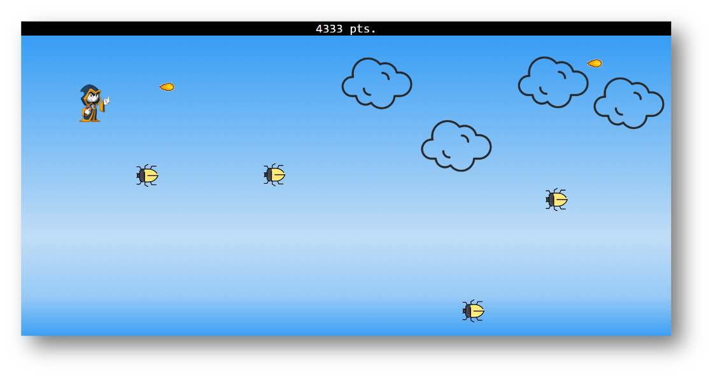

# Side-Scrolling Wizard Game



## Table of Contents
- [Project Overview](#project-overview)
- [Game Features](#game-features)
- [Getting Started](#getting-started)
- [How to Play](#how-to-play)
- [Built With](#built-with)
- [License](#license)

## Project Overview
Welcome to the Side-Scrolling Wizard Game! In this game, you take on the role of a powerful wizard soaring through the sky, but beware! Vicious bugs are swarming towards you, and your only defense is to shoot them down with your magical fireballs. Every successful hit earns you points, but if a bug makes contact, it's game over.


## Game Features
- **High-Flying Wizard:** Navigate a wizard character through the boundless sky.
- **Bugs Attack:** Bugs appear from the right and approach you relentlessly.
- **Fireball Arsenal:** Shoot fireballs to fend off the approaching bugs.
- **Score System:** Accumulate points by hitting bugs with your fireballs.
- **Game Over:** The game ends when a bug touches your wizard.
- **Addictive Gameplay:** Enjoy a fun and addictive side-scrolling gaming experience.

## Getting Started
To get started with the Side-Scrolling Wizard Game, simply follow these steps:

1. Clone the repository to your local machine:

   ```bash
   git clone https://github.com/your-username/side-scrolling-wizard-game.git

